<p align="center">
  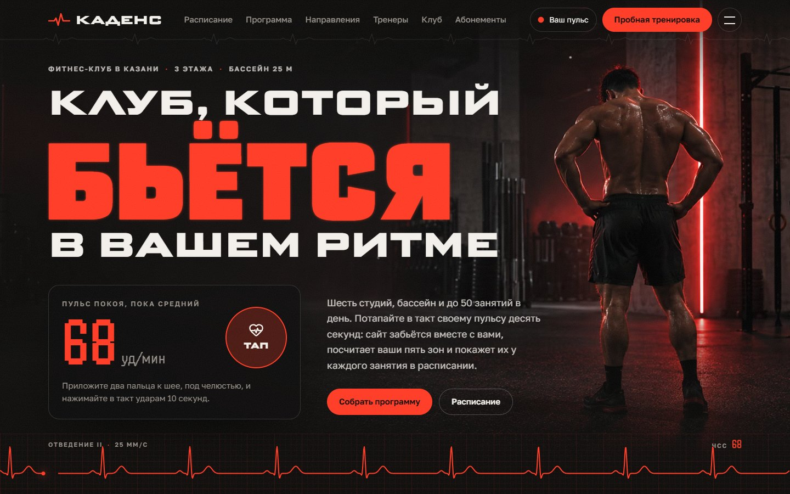
</p>

# Каденс — фитнес-клуб, который бьётся в ритме посетителя

> Сайт вымышленного трёхэтажного фитнес-клуба в Казани, построенный вокруг пульса. Посетитель десять секунд тапает в такт своему сердцу, интерфейс начинает биться в его ритме, а у каждого занятия в расписании появляется его личный коридор: «ваша зона: 151–163».


**Главное:**

- **Интерфейс бьётся вместе с посетителем.** Один цикл `requestAnimationFrame` на весь сайт идёт с частотой пульса покоя: заголовки на Science Gothic расширяются по оси `wdth` на каждом ударе, кардиограммы на canvas идут в том же ритме. Пульс меряется тапом, вводится вручную или берётся из пробы Руфье, а зоны по Танаке и Карвонену подставляются в расписание, классы, билеты и статьи.
- **Настоящая запись, а не форма «перезвоните мне».** Неделя занятий генерируется из шаблона, тренеры расставляются перебором с возвратом без накладок. Место — это номер от 1 до вместимости зала, и уникальный индекс `(sessionId, seat)` не даёт записать больше людей, чем мест, на уровне базы. Лист ожидания продвигается сам, неделю из конструктора можно записать одной формой, билет выгружается в `.ics`.
- **Продукт целиком.** 20 разделов публичного сайта и шесть типов детальных страниц, конструктор недели под пульс, проба Руфье с метрономом и пульт администратора: день по студиям, замены и отмены, отметки о приходе, заявки с приложенной программой.

## Идея

«Каденс» — концепт большого клуба на набережной Казанки: три этажа и 6 200 м², бассейн «Глубина» на 25 метров и шесть дорожек, шесть студий со своими именами («Вираж», «Ринг», «Кузня», «Такт», «Тишина», «Опора»), до 50 групповых занятий в день и 12 тренеров. Название отсылает к каденсу — спортивному термину для частоты шагов или оборотов педалей: клуб говорит с посетителем на языке ритма.

Сквозная метафора — пульс. Логотип — один удар кардиограммы, как светодиодная линия над ресепшеном; под шапкой тянется ЭКГ-полоса, которая заполняется по мере прокрутки; штрихкод на билете тоже кардиограмма. Главное действие сайта — потапать в такт сердцу: после этого сайт бьётся в ритме посетителя, пересчитывает пять пульсовых зон и показывает у каждого занятия не «средняя интенсивность», а конкретные удары в минуту. Каждый класс построен вокруг своей зоны, а тренеры на портретах подсвечены контровым светом цвета той зоны, в которой обычно работают.

Проект показывает сайт уровня продукта: доменную математику (формулы зон, индекс Руфье), живое расписание с записью и защитой от гонок в базе, конструктор, который собирает неделю из реально свободных мест, и пульт, изменения из которого сразу видны на сайте. Он адресован фитнес-клубам и студиям как референс и разработчикам как пример Next.js App Router с Prisma 7, server actions и анимацией, которая уважает `prefers-reduced-motion`. Концепция подробно — в [docs/CONCEPT.md](docs/CONCEPT.md), договорённости по коду и связи данных — в [docs/ARCHITECTURE.md](docs/ARCHITECTURE.md).

## Скриншоты

<table>
  <tr>
    <td width="50%" valign="top">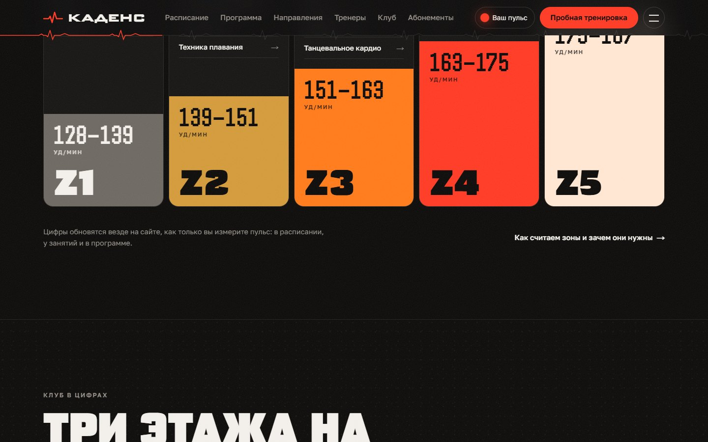<br><sub>Личные пульсовые зоны</sub></td>
    <td width="50%" valign="top">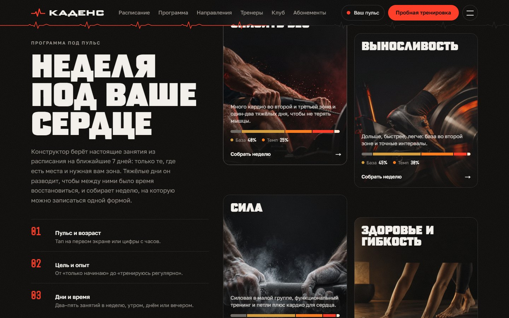<br><sub>Программа под ваше сердце</sub></td>
  </tr>
  <tr>
    <td width="50%" valign="top">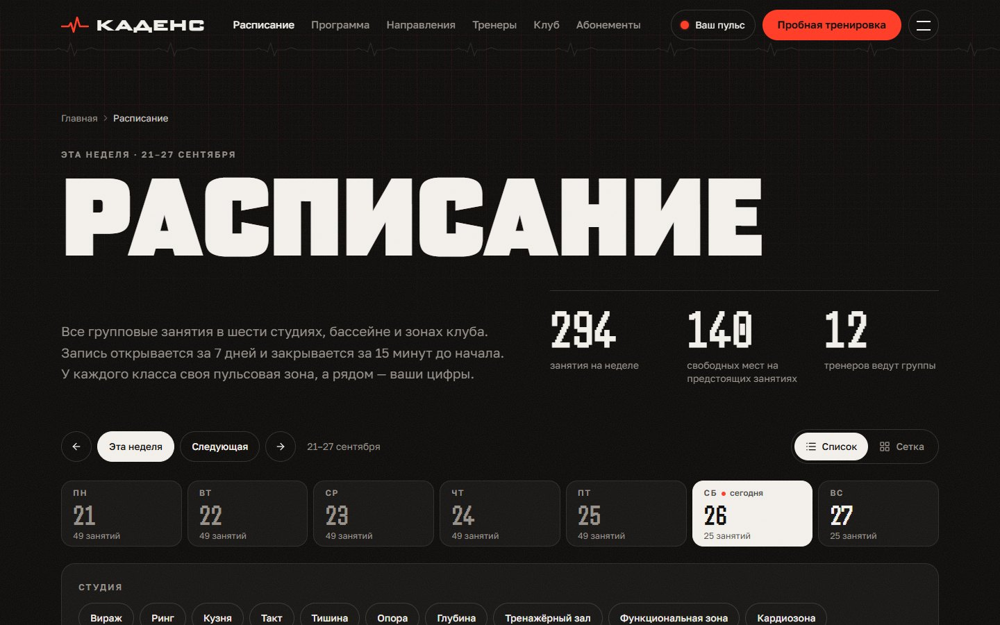<br><sub>Расписание</sub></td>
    <td width="50%" valign="top">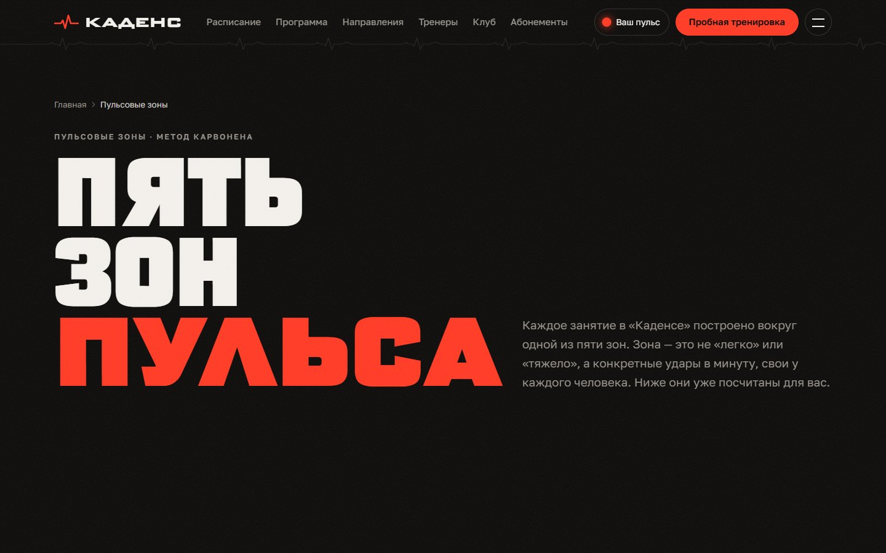<br><sub>Пять зон пульса</sub></td>
  </tr>
  <tr>
    <td width="50%" valign="top">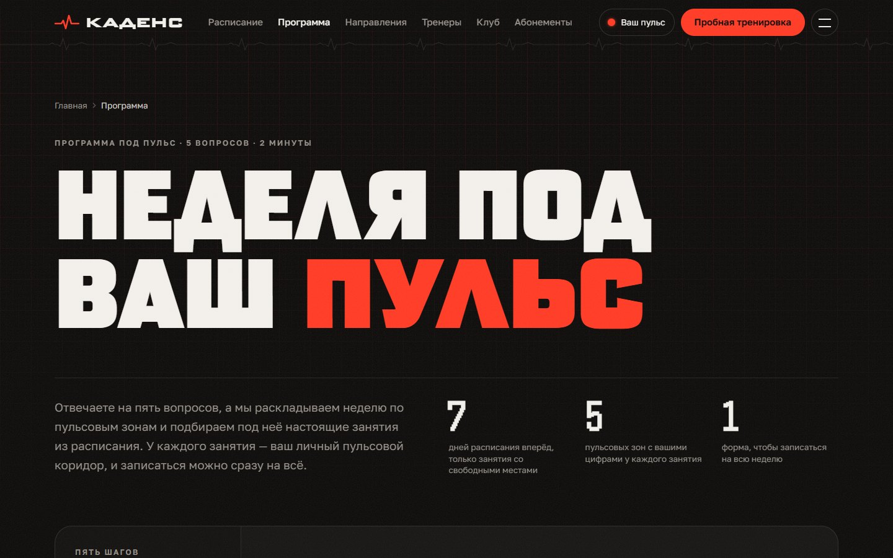<br><sub>Конструктор недели</sub></td>
    <td width="50%" valign="top">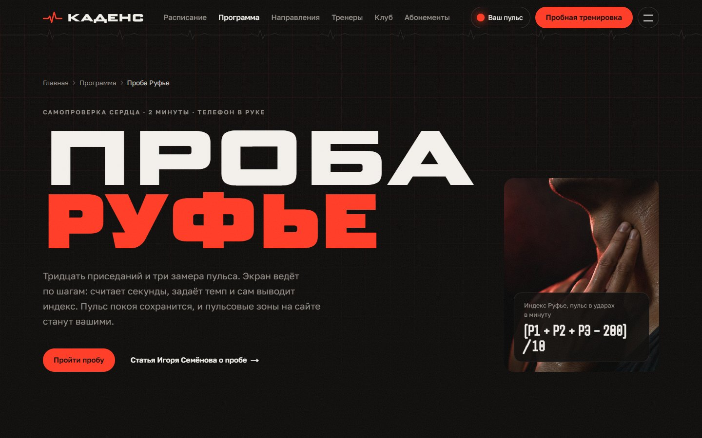<br><sub>Проба Руфье</sub></td>
  </tr>
  <tr>
    <td width="50%" valign="top">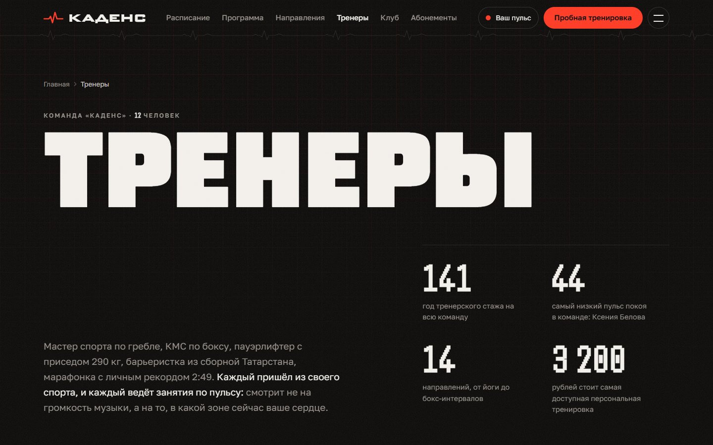<br><sub>Тренеры</sub></td>
    <td width="50%" valign="top">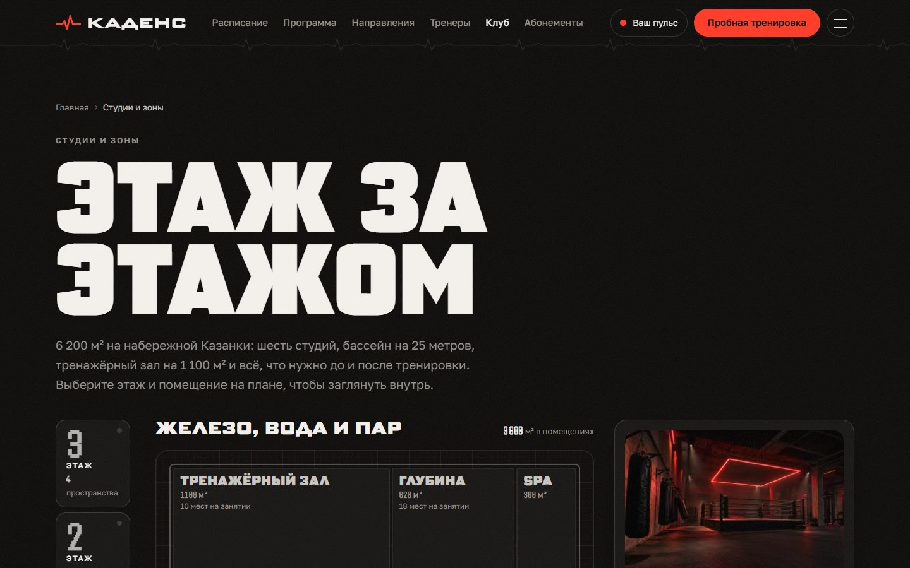<br><sub>Студии по этажам</sub></td>
  </tr>
  <tr>
    <td width="50%" valign="top">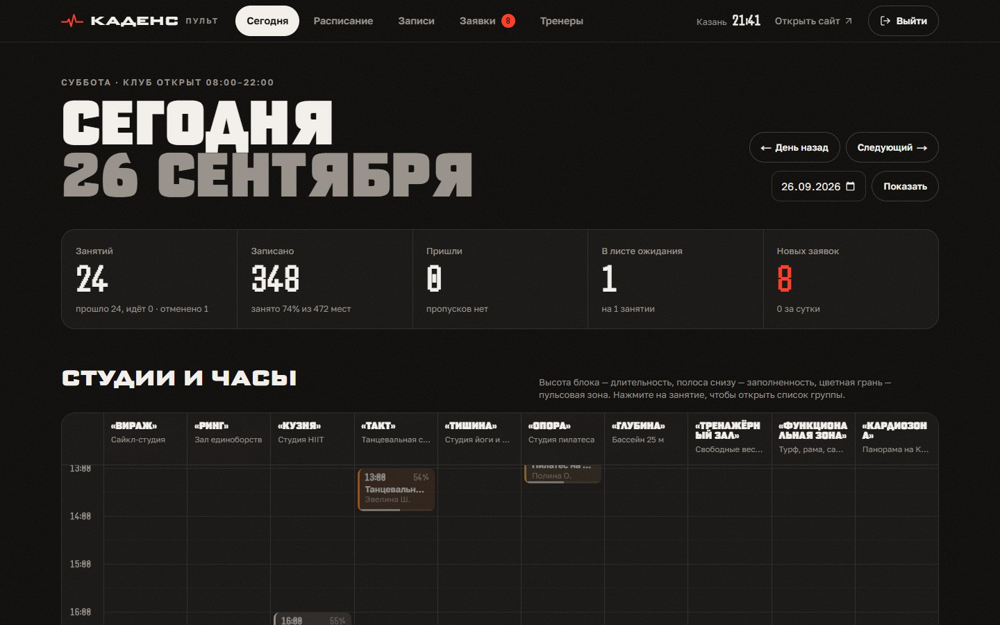<br><sub>Пульт администратора: сегодня</sub></td>
    <td width="50%" valign="top">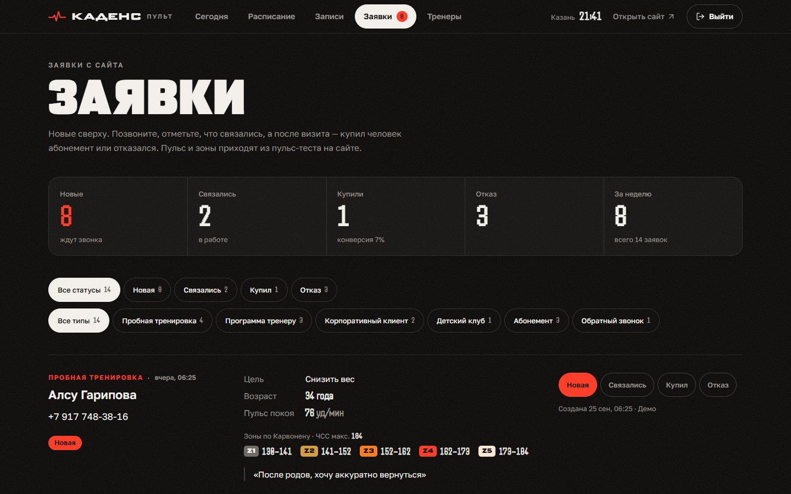<br><sub>Заявки с сайта</sub></td>
  </tr>
</table>

<p align="center">
  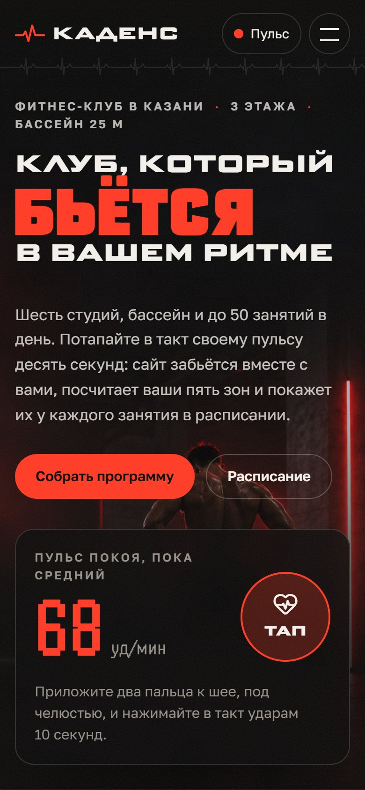
  <br><sub>Мобильная версия</sub>
</p>

## Возможности

### Пульс и зоны на всём сайте

- Кнопка «Ваш пульс» в шапке открывает панель с тапом, ползунком возраста, степпером пульса покоя и шкалой пяти зон с личными диапазонами.
- Тап-замер: два пальца на шею, нажимать в такт около десяти секунд. После паузы в 2,2 секунды (от пяти ударов) или на двенадцатом ударе медиана интервалов становится пульсом покоя, результат получает словесную оценку («Норма для активного человека»). Подсказки озвучиваются через `aria-live`.
- До замера сайт бьётся с частотой 68 уд/мин для возраста 30 лет и честно подписывает цифры как средние. Пульс, возраст и источник замера хранятся в `localStorage`.
- Личные диапазоны видны в расписании, на карточках и фазах классов, на билете, у тренеров, в конструкторе и прямо в статьях журнала.
- `/zones`: «лестница» из пяти зон, формулы с подставленными цифрами посетителя (пересчитываются на лету), что тренирует каждая зона и как понять, что вы в ней, раскладка времени по зонам под цель на 3–6 часов в неделю и честный блок о погрешности формул.

### Главная

- Первый экран: слово «бьётся» пульсирует в ритме посетителя, рядом карточка тапа, после замера раскрывается шкала зон, внизу полоса монитора «Отведение II · 25 мм/с» с текущей ЧСС.
- «Сейчас в клубе»: часы по Казани, число людей в клубе, занятия, которые идут прямо сейчас, и ближайшие на сегодня; поздно вечером — первые занятия следующего дня.
- Пять зон «лестницей» с личными цифрами, клуб в цифрах, лента студий, конструктор с четырьмя целями, голографические карточки тренеров, отзывы «было → стало», тарифы и бесплатная пробная тренировка.
- В шапке — живой статус клуба (сколько людей внутри, открыто ли), обновляется раз в минуту через `/api/club-status`.

### Расписание и запись

- `/schedule`: прошлая, текущая и следующая недели; запись открыта на 7 дней вперёд, каждую полночь открывается ещё один день. Сверху — число занятий, свободных мест и тренеров на неделе.
- Дни — вкладки со счётчиком подходящих занятий. Фильтры: студия, зона Z1–Z5, утро / день / вечер, направление, тренер, «только со свободными местами». «Подсветить мою зону» обводит подходящие классы, остальные приглушает.
- Два вида: список по частям дня и сетка «студии × часы» с линией текущего времени. Всё состояние живёт в URL, ссылкой на отфильтрованный день можно поделиться.
- Строка занятия: время, длительность, класс, студия, тренер (с пометкой «замена»), полоска заполненности цвета зоны, зона и личный диапазон, статус («Идёт сейчас», «Осталось 2 места», «Мест нет, можно в лист ожидания», «Отменено»). Открытая страница сама пересчитывает, что уже началось.
- Страница занятия `/schedule/[id]`: карта мест точками (занятые — цветом зоны, свободные — контуром, очередь — пунктиром), тренер, кривая пульса по минутам с фазами и личными цифрами, что взять с собой, это же занятие в другие дни.
- Форма записи — имя, телефон с живой маской и согласие. Если мест нет, кнопка превращается в «Встать в лист ожидания» и показывает, сколько людей впереди. Повторная запись с того же номера даёт ссылку на существующую. Для закрытых занятий объясняется причина (отменено, уже идёт, запись закрылась за 15 минут, ещё не открылась — с датой) и предлагается ближайшее свободное время того же класса.

### Билет и «Мои записи»

- После записи открывается `/booking/KD-…?new=1`: по пустому месту проходит кардиограмма, билет «печатается», код собирается посимвольно. Анимация играет один раз.
- Билет с отрывным корешком: класс, время, студия и этаж, тренер, номер места («07 из 30») или позиция в очереди, длительность и калории, личный коридор пульса, кривая занятия, код и штрихкод-кардиограмма.
- Заголовок и штамп зависят от состояния: записаны, идёт сейчас, N-й в листе ожидания, место не освободилось, засчитано, неявка, отменена вами или клубом.
- Файл `.ics` для календаря с напоминанием за два часа, отмена по последним четырём цифрам телефона, кнопка «Обновить» для листа ожидания.
- `/booking`: код и четыре цифры телефона показывают все записи этого номера со вчерашнего дня. Код, набранный в русской раскладке, исправляется сам, пара код/цифры помнится до закрытия вкладки.

### Программа под пульс

- Пять шагов: пульс, цель («Снизить вес», «Выносливость», «Сила», «Здоровье и гибкость»), опыт, сколько раз в неделю (2–5, с советом под цель), удобное время. Ссылки `?goal=` сразу выбирают цель.
- Результат — неделя из настоящих занятий со свободными местами: полоса на 7 дней, где тренировочные дни шире и над каждым стоит зубец кардиограммы высотой по зоне, и у каждого занятия строка «зачем оно в плане».
- «Время в зонах»: минуты недели против раскладки, которую просит цель, с выводом, какой зоны не хватает. Если занятий меньше, чем нужно, конструктор предлагает добавить время дня.
- «Записаться на всю неделю» — одна форма, по строке результата на каждое занятие (записаны, очередь и место в ней, уже записаны, не вышло). «Отправить тренеру» — заявка с программой, а если они есть, то и с пульсом, возрастом и последней пробой Руфье.

### Проба Руфье

- `/program/ruffier` ведёт по шагам с телефоном в руке: P1 за 15 секунд (или тапом), 30 приседаний за 45 секунд под метроном, минута восстановления с окнами для P2 и P3.
- Крупные цифры, отсчёт перед стартом, звуковые сигналы по желанию, экран не гаснет, пока идёт таймер. Есть режим ручного ввода.
- Итог: индекс, оценка, положение на шкале и что делать дальше. P1 становится пульсом покоя сайта, результат прикладывается к программе для тренера.

### Направления, тренеры и клуб

- `/classes`: 14 классов с фильтрами по зоне, цели, залу и опыту (в URL, отрисовка на сервере). Страница класса: кривая пульса, фазы с личными диапазонами, минуты в каждой зоне, тап-замер, тренеры, ближайшие занятия, студия и похожие классы.
- `/coaches`: команда по цвету контрового света, голографические карточки с фильтрами по зоне и направлению, прайс персональных тренировок. Страница тренера: номер карточки, «оборот» с рейтингом и пятью характеристиками против среднего по команде, два сердца рядом (тренера — с его пульсом покоя, посетителя — в ритме сайта), биография, сертификаты, классы, ближайшие занятия по дням, отзывы, заявка на персональную.
- `/studios`: «лифт» на три этажа и схематичный план, где площадь каждого помещения пропорциональна реальной; наведение или первый тап показывает превью, второй открывает страницу. 15 страниц помещений: паспорт, классы и живое расписание там, где они есть, план этажа с отмеченным помещением.
- `/club`, `/kids`, `/contacts`: история и принципы клуба, светодиодная линия, которая рисует себя при прокрутке, детский клуб, нарисованная карта Казанки и Кремля без картографических сервисов, где метка клуба пульсирует в ритме посетителя.

### Абонементы, заявки и контент

- `/memberships`: шесть тарифов («Утро», «Ритм», «Каденс Про», «Семья», разовое посещение, пробная неделя), переключатель месяц / год, популярный тариф светится на каждом ударе, таблица сравнения, заявка с тарифом, выбранным на карточке.
- `/trial`, `/corporate`: первый визит по шагам с личными зонами; обеденное табло классов с 12:00 до 14:00 для корпоративных клиентов, собранное из того же шаблона расписания.
- Заявки шести видов (пробная, программа, корпоратив, детский клуб, абонемент, обратный звонок) уходят в `/api/leads` и появляются в пульте.
- `/reviews` — 12 историй, у каждой одно измеренное число «было → стало», фильтр по цели. `/journal` — 6 статей с категориями в URL и виджетом личных зон, встроенным в текст. `/faq` — 26 вопросов в пяти разделах с поиском. `/rules` и `/privacy` — документы с оглавлением, которое отмечает текущий раздел.

### Пульт администратора

- `/admin` (демо-пароль `kadens`, он же в `.env.example` и на экране входа). «Сегодня»: показатели дня (занятия, заполненность, пришли, лист ожидания, новые заявки) и доска «студии × часы», где каждый класс — блок по длительности, с линией текущего времени; перелистывание на 8 недель назад и 4 вперёд.
- «Расписание»: неделя по дням, фильтр по студии, режим «только изменения» (замены и отмены).
- Группа занятия: места и полные телефоны, отметки «пришёл / не пришёл», «отметить всех», отмена записи с передачей места первому в очереди, перевод из очереди в группу, запись с ресепшена, замена тренера и отмена занятия с публичной пометкой (или возврат в расписание).
- «Записи»: поиск по телефону, коду и имени, фильтры по статусу, источнику и датам. «Заявки»: фильтры со счётчиками, личные зоны заявителя, разобранная программа с отметкой, записался ли человек на каждое занятие, результат пробы Руфье, статус заявки. «Тренеры»: нагрузка за неделю — занятия по дням, замены, заполненность, посещаемость, ближайшее занятие.

## Как это устроено

### Пульсовый движок

`PulseProvider` (`src/components/pulse/PulseProvider.tsx`) держит один цикл `requestAnimationFrame`. Фаза удара растёт на `dt × bpm / 60`, огибающая `beatEnvelope` даёт сильный «тук» на пике R и мягкий второй тон, форма кардиограммы `ecgValue` — сумма гауссиан для зубцов P, QRS и T. Цикл работает только пока есть подписчики, вкладка видима и движение разрешено; при `prefers-reduced-motion` подписчики получают один статичный кадр.

- `useBeat` пишет прямо в DOM, минуя ре-рендер React на каждом кадре: `BeatWord` меняет `font-variation-settings: "wdth"` и насыщенность, `BeatDot` — масштаб и свечение, `BeatVar` — CSS-переменную `--beat`, `MapBeat` — ореол метки на карте.
- `EcgMonitor` — canvas «прикроватного монитора»: перо идёт попиксельно со скоростью бумаги, стирает впереди себя и рисует миллиметровку; учитывает `devicePixelRatio` и `ResizeObserver`.
- `PulseTap` считает пульс через `bpmFromTaps` (медиана интервалов, от 4 тапов, 38–200 уд/мин) и вызывает `kick()`, который ставит фазу на пик R: сайт бьётся точно под пальцем.

Формулы — чистые функции в `src/lib/zones.ts`, одинаково работают на сервере и в браузере. HRmax по Танаке — `208 − 0,7 × возраст`, зоны по Карвонену — доли резерва 50–60, 60–70, 70–80, 80–90 и 90–100 %:

```ts
export function zoneRanges(rest: number, age: number): ZoneRange[] {
  const max = heartRateMax(age);
  const reserve = Math.max(0, max - rest);
  return ZONES.map((z) => ({
    id: z.id,
    lo: Math.round(rest + reserve * z.reserve[0]),
    hi: Math.round(rest + reserve * z.reserve[1]),
  }));
}
```

Для пульса покоя 68 и возраста 30 это HRmax 187 и Z3 «Темп» 151–163 уд/мин. Индекс Руфье — `(P1 + P2 + P3 − 200) / 10` с пятью градациями от «Отлично» (≤ 0) до «Плохо» (> 15).

### Расписание и модель данных

Тексты, фото и цены живут в типизированных файлах `src/data`; база хранит только то, что меняется во время работы: зеркало каталога (студии, форматы, тренеры по `slug`), занятия, записи и заявки.

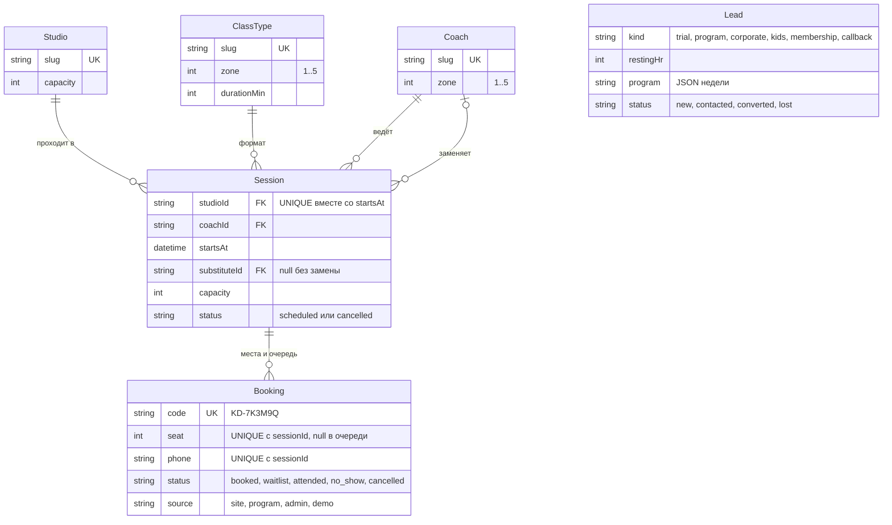

- Шаблон недели `src/data/timetable.ts`: 49 слотов на каждый будний день и 25 на выходной. `planDay` (`src/lib/timetable.ts`) расставляет тренеров поиском в глубину с возвратом: сначала классы с самым коротким списком возможных тренеров, у каждого тренера не меньше 15 минут между занятиями. Порядок кандидатов сдвигается от дня к дню, поэтому лица в расписании меняются, а сама функция детерминирована: одна дата — один план.
- Недели создаются лениво: любой запрос расписания проходит через `ensureRange` → `ensureWeek`, который вставляет недостающие занятия. Индекс `@@unique([studioId, startsAt])` делает генерацию идемпотентной даже при параллельных запросах. `prisma/seed.ts` заранее создаёт текущую и следующую неделю.
- Клуб живёт по московскому времени (UTC+3 без перехода): `src/lib/time.ts` считает дни, часы работы и «сейчас» независимо от часов посетителя.
- `toView` превращает строку базы в `SessionView` с полями `bookable` и `closedReason` (`cancelled`, `started`, `closing`, `not-open-yet`) — одна точка правды для статусов, кнопок и API.

### Запись, лист ожидания и отмена

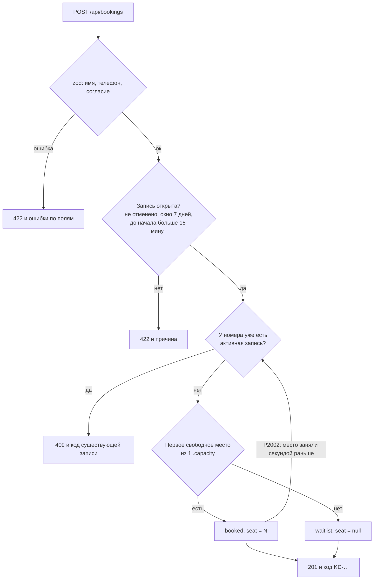

- `createBooking` (`src/lib/booking.ts`) делает до шести попыток: нарушение уникального индекса (`P2002`) по месту или коду значит, что кто-то успел раньше, и место ищется заново. После шести неудач — `409 conflict`.
- Отменённая запись того же номера переиспользуется (этого требует `@@unique([sessionId, phone])`), а её `createdAt` обновляется, чтобы повторная запись встала в конец очереди. Код — `KD-` и шесть символов из алфавита без похожих знаков, через `crypto.randomInt`.
- Отмена гостем (`cancelByGuest`) требует код и последние четыре цифры телефона: место можно отдать не позже чем за два часа, из очереди выйти — до начала. `releaseSeat` в `prisma.$transaction` отменяет запись и тут же отдаёт освободившееся место первому в листе ожидания (`promoteWaitlist`).
- `POST /api/bookings/batch` принимает до семи занятий и возвращает результат по каждому; `POST /api/bookings/lookup` открывает «Мои записи»; `booking/[code]/calendar` отдаёт `.ics` с `VALARM` за два часа.
- Валидация — zod 4 в `src/lib/validation.ts`: имя 2–60 символов, телефон нормализуется к `7XXXXXXXXXX` (принимает `8…` и 10 цифр), согласие обязательно; длины комментариев и JSON программы ограничены.

### Конструктор программы и проба Руфье

`buildProgram` (`src/lib/program.ts`) — чистая функция над списком `SessionView`, поэтому её легко проверить отдельно от базы:

1. `targetZones` раскладывает число тренировок по долям зон цели (`zoneMix` в `src/data/goals.ts`) методом наибольшего остатка. Уровень ограничивает потолок: «только начинаю» — Z3, «время от времени» — Z4, «регулярно» — Z5. Одиночная Z1 превращается в Z2, если цель не «Здоровье и гибкость».
2. В пул попадают только занятия ближайших 7 дней, открытые для записи, со свободными местами, подходящие по уровню и времени дня.
3. Подбор идёт от самых тяжёлых зон: штрафы за отклонение от целевой зоны, за низкое место класса в списке цели, за соседние дни (сильнее, если оба дня в Z4 и выше), за повтор формата и почти заполненный класс; одно занятие в день.
4. Минуты по зонам считаются из фаз каждого класса (`structure`), нехватка занятий объясняется текстом `shortfall`.

Заявка «тренеру» сохраняет JSON недели в `Lead.program`; пульт разбирает его в `src/components/admin/lead-program.ts` терпимо к мусору, ведь JSON пришёл из браузера. Проба Руфье (`RuffierTest`, `RuffierTimed`, `ruffier-hooks.ts`) держит время на `performance.now()` с `requestAnimationFrame` и запасным интервалом в 200 мс, поэтому секундомер не дрейфует и не останавливается в фоне; сигналы — WebAudio, включённый жестом пользователя; экран не гаснет благодаря Screen Wake Lock API. Итог сохраняет P1 как пульс покоя (`source: "ruffier"`) и кладёт последнюю пробу в `localStorage`, откуда её берёт конструктор.

### Голографические карточки

`HoloCard` (`src/components/coaches/HoloCard.tsx`) — ссылка-карточка 5:7 в `perspective`. На движение мыши она пишет в CSS-переменные точку блика `--mx/--my`, наклон `--rx/--ry` (до ±7° и ±8°) и силу фольги `--foil`. Фольга в `globals.css` — `conic-gradient` от цвета зоны тренера через `mix-blend-mode: color-dodge` с радиальной маской вокруг точки блика, поверх — блик в режиме `overlay`. Рейтинг в углу — среднее пяти характеристик, цвет рамки и фольги совпадает с контровым светом на фото.

На сенсорных экранах (`pointer: coarse`) фольга медленно переливается сама: анимируется свойство `--mx`, зарегистрированное через `@property`. Там, где браузер отдаёт `deviceorientation` без запроса разрешения (Android Chrome), карточка ещё и следует за наклоном телефона (углы `gamma` и `beta`, нормированные на ±30°); на iOS, где нужен `requestPermission`, наклон не запрашивается. При `prefers-reduced-motion` наклон и переливание отключаются.

Из той же серии деталей — штрихкод билета `CardioBarcode`: кардиограмма, детерминированная по коду (FNV-1a и mulberry32), так что один код всегда даёт одну и ту же полосу, и на сервере, и в браузере.

### Пульт администратора и демо-режим

- Вход — `src/lib/auth.ts`: пароль сравнивается через `timingSafeEqual`, cookie `kd_admin` содержит срок действия и его HMAC-SHA256 на `ADMIN_SECRET`, живёт 12 часов, `httpOnly`, `sameSite=lax`, `secure` в production. `requireAdmin()` проверяется в layout панели, на каждой странице и в каждом server action.
- Действия (`src/app/admin/actions.ts`) — server actions с `useActionState`; после изменения `revalidatePath("/", "layout")`, поэтому замена или отмена сразу видны в публичном расписании.
- Правила пульта: заменить можно только тренером этого формата и без накладки с его занятием в другой студии; отмена занятия не удаляет записи, и возврат восстанавливает группу; отметки о приходе открываются за 30 минут до начала; запись с ресепшена идёт через тот же `createBooking`, с теми же местами, очередью и защитой от дублей, но без окна онлайн-записи.
- SQLite `LIKE` не сравнивает кириллицу без учёта регистра, поэтому поиск по имени перебирает несколько написаний, а код записи узнаётся в любом виде (`kd7k3m9q`, `KD-7K3M9Q`).
- Демо-режим (`src/lib/demo.ts`, `DEMO_BOOKINGS="true"`): каждая сгенерированная неделя получает правдоподобную заполненность по времени суток, выходным и популярности формата, прошедшие занятия — отметки «пришёл» и около 11 % неявок, будущие — две замены тренера и одну отмену; занятия ближайших двух суток чаще оставляют несколько свободных мест. В пульт приходят 14 заявок. Случайные числа берутся из генератора с сидом от даты недели, а данные хранятся как обычные строки с `source: "demo"` и кодами `DM-`, так что реальные записи смешиваются с ними естественно. Для настоящего клуба режим выключается значением `"false"`.

## Дизайн

**Палитра** — «тёмный спорт»: асфальт, мел и один горячий акцент. Токены заданы RGB-триплетами в `src/app/globals.css` и подключены в `tailwind.config.ts` как `rgb(var(--token) / <alpha-value>)`, поэтому работают полупрозрачные варианты вроде `border-line/10`. Сайт только тёмный (`color-scheme: dark`).

| Токен | Цвет | Роль |
| --- | --- | --- |
| `asphalt` | `#0C0B0A` | фон страницы |
| `graphite` | `#171514` | карточки |
| `raised` | `#211E1C` | приподнятые элементы |
| `chalk` | `#F2EFEA` | основной текст, линии (`line`) |
| `dust` | `#969089` | вторичный текст |
| `pulse` | `#FF3A24` | единственный акцент |
| `z1`…`z5` | `#6E6862`, `#D39A3A`, `#FF7A1A`, `#FF3A24`, `#FFE6D2` | зоны: Разминка, База, Темп, Порог, Максимум |

**Типографика** — три семейства с кириллицей через `next/font/google`:

- Science Gothic — заголовки капсом. Переменная ось ширины 50–200 делает слова «бьющимися»; ширина задаётся утилитами `.stretch-narrow / normal / wide / ultra` (56 / 100 / 130 / 170). Размеры `d-1`…`d-4` резиновые через `clamp()`.
- Golos Text — основной текст, 16,5 px с интерлиньяжем 1,55.
- Handjet — цифры пульса, времени и цен (`.digits`: ось `ELSH`, табличные цифры), как на табло беговой дорожки.

**Фактуры и сетка.** Миллиметровка кардиограммы (`.ecg-grid`), крошка резинового пола (`.rubber`), плёночное зерно поверх всего сайта. Контейнер до 1360 px с полями `clamp(16px, 4vw, 48px)`, свои брейкпоинты 560 / 820 / 1100 / 1360 / 1600 px, асимметричные сетки из 12 колонок с липкими левыми колонками, горизонтальные ленты со snap-прокруткой.

**Движение.** Одна кривая для переходов и проявлений — `cubic-bezier(0.16, 1, 0.3, 1)` (`ease-silk`). `Reveal` проявляет блоки один раз: прозрачность, сдвиг на 28 px и размытие 8 px. Вход первого экрана сделан на CSS, чтобы он был виден и анимирован ещё до загрузки JavaScript. Главная кнопка тянется к курсору (`MagneticButton`, только для точного указателя), прокрутка — Lenis, фильтры перестраиваются layout-анимацией framer-motion.

**Мобильная версия.** Mobile first, правило проекта — никакой горизонтальной прокрутки на 375 px: отдельный кадр первого экрана для телефона, фильтры расписания свёрнуты за кнопкой, панель пульса становится листом на всю ширину экрана, сетка расписания и вкладки пульта прокручиваются вбок, кнопки и чипы не ниже 44 px.

**Доступность.** Ссылка «Перейти к содержанию», видимый `:focus-visible`, `lang="ru"`. При `prefers-reduced-motion` останавливается пульсовый цикл, монитор рисует статичную ленту, проявления и магнитные кнопки отключаются. Дни расписания — ARIA tablist со стрелками, Home и End; шаги конструктора и пробы переводят фокус на новый заголовок; поля с ошибкой получают `aria-invalid`, а форма записи фокусирует первое из них; счётчики и статусы объявляются через `aria-live`; у графиков и карты мест есть текстовые описания.

**Фотографии.** 57 сгенерированных кадров; промпты — в `docs/PHOTO_PROMPTS.md` (по одному на кадр) и `docs/BATCH_PROMPTS.md` (четыре прохода для чат-модели генерации изображений), источник правды — `docs/shot-list.json`. Новые файлы кладутся в `photos-raw/` под id кадра, `npm run photos` обрезает каждый под пропорцию кадра, сжимает в `public/photos/`, делает blur-заглушку и регистрирует в `src/data/photo-manifest.json`. Каждое фото на сайте проходит через `MediaFrame`, который, пока файла нет, рисует свет этого кадра на CSS. Люди — только силуэтами, со спины или в кадрировании: никаких лиц вымышленных людей. Портреты тренеров — одна серия в контровом свете, цвет контура — обычная зона тренера.

## Стек

| Технология | Версия | Для чего |
| --- | --- | --- |
| Next.js | 16.3 | App Router, серверные компоненты, route handlers, server actions, `next/image` (AVIF и WebP), `next/font`, sitemap и robots |
| React | 19.3 | интерфейс, `useActionState` в формах пульта |
| TypeScript | 5.9 | строгий режим во всём проекте |
| Tailwind CSS | 3.4 | токены на CSS-переменных, свои брейкпоинты и шкала заголовков |
| framer-motion | 13.4 | проявления, смена шагов, layout-анимация, печать билета |
| Lenis | 1.3 | плавная прокрутка публичного сайта |
| Prisma | 7.10 | схема, миграции, сид; клиент генерируется в `src/generated/prisma` |
| SQLite, `@prisma/adapter-better-sqlite3` | 7.10 | локальная база через драйвер-адаптер |
| zod | 4.6 | валидация тел API и форм |
| lucide-react | 1.48 | иконки |
| clsx | 2.1 | сборка классов |
| sharp | 0.35 | обработка фотографий в `scripts/process-photos.mjs` |
| tsx | 4.23 | запуск `prisma/seed.ts` |
| Science Gothic, Golos Text, Handjet | — | заголовки, текст, цифры |

## Структура проекта

```
kadens-fitness/
├── docs/
│   ├── CONCEPT.md              # концепция: идея, клуб, визуал, страницы
│   ├── ARCHITECTURE.md         # договорённости: токены, связи данных, модель пульса, правила клуба
│   ├── shot-list.json          # список кадров, источник правды для фото
│   ├── PHOTO_PROMPTS.md        # промпт на каждый кадр
│   ├── BATCH_PROMPTS.md        # четыре прохода для чат-модели
│   └── concept-board.html      # первый интерактивный черновик концепции (рабочее название «Такт»)
├── prisma/
│   ├── schema.prisma           # Studio, ClassType, Coach, Session, Booking, Lead
│   ├── migrations/             # начальная миграция
│   └── seed.ts                 # каталог и занятия этой и следующей недели
├── public/photos/              # 57 оптимизированных фотографий
├── photos-raw/                 # исходники фото (в git только README)
├── scripts/
│   ├── process-photos.mjs      # кадрирование, сжатие, blur-заглушки, манифест
│   ├── build-shotlist.mjs      # PHOTO_PROMPTS.md и src/data/shot-meta.ts из shot-list.json
│   ├── build-batch-prompts.mjs # BATCH_PROMPTS.md
│   └── dev.mjs                 # next dev из корня проекта при любом рабочем каталоге
├── src/
│   ├── app/
│   │   ├── (site)/             # публичные страницы
│   │   ├── admin/              # пульт: login, (panel)/…, actions.ts
│   │   ├── api/                # bookings (+ batch, cancel, lookup), leads, program, club-status
│   │   ├── layout.tsx          # шрифты, метаданные, PulseProvider
│   │   ├── globals.css         # токены, фактуры, голографическая фольга
│   │   └── sitemap.ts, robots.ts
│   ├── components/
│   │   ├── pulse/              # PulseProvider, BeatWord, EcgMonitor, PulseTap, шкалы зон
│   │   ├── schedule/           # доска расписания, фильтры, сетка, карта мест, форма записи
│   │   ├── booking/            # билет, штрихкод-кардиограмма, «Мои записи», отмена
│   │   ├── program/            # конструктор, результат, запись на неделю, проба Руфье
│   │   ├── coaches/            # HoloCard, характеристики, сравнение сердец
│   │   ├── club/               # поэтажный тур, планы, карта города
│   │   ├── admin/              # доска дня, формы server actions, разбор программы из заявки
│   │   ├── layout/             # Header со статусом клуба, Footer, EcgRail, SmoothScroll
│   │   ├── ui/                 # MediaFrame, Reveal, MagneticButton, формы, карточки
│   │   └── home/, classes/, zones/, memberships/, journal/, faq/, leads/
│   ├── data/                   # типизированный контент: пространства, классы, тренеры, цели, тарифы, шаблон недели
│   ├── lib/
│   │   ├── zones.ts            # Танака, Карвонен, Руфье, тап-замер
│   │   ├── club.ts, time.ts    # факты клуба, правила записи, московское время
│   │   ├── timetable.ts        # шаблон → занятия дня, подбор тренеров
│   │   ├── schedule.ts         # ленивые недели, SessionView, «сейчас в клубе»
│   │   ├── booking.ts          # места, лист ожидания, отмена, поиск записей
│   │   ├── program.ts          # конструктор недели
│   │   ├── demo.ts             # демо-записи, замены и заявки
│   │   ├── auth.ts             # подписанная cookie пульта
│   │   └── validation.ts       # схемы zod
│   └── generated/prisma/       # клиент Prisma (генерируется, не в git)
├── start.bat                   # запуск в Windows двойным щелчком
├── prisma.config.ts
├── tailwind.config.ts
└── .env.example
```

## Запуск

Нужны Node.js 20.9 или новее и npm. Отдельный сервер базы не нужен: SQLite-файл создаётся в `prisma/`.

В Windows достаточно дважды щёлкнуть `start.bat`: он установит зависимости, создаст `.env` из примера, подготовит базу, при отсутствии фото запустит их обработку, откроет браузер и поднимет dev-сервер. Вручную:

```bash
npm install                  # postinstall выполнит prisma generate
cp .env.example .env         # в Windows: copy .env.example .env
npx prisma migrate deploy    # создаст prisma/dev.db
npx prisma db seed           # студии, классы, тренеры и занятия этой и следующей недели
npm run photos               # необязательно: оптимизированные фото уже лежат в public/photos
npm run dev
```

Сайт откроется на http://localhost:3200, пульт — на http://localhost:3200/admin (демо-пароль `kadens` из `.env.example`). Миграцию и сид можно выполнить одной командой `npm run setup`.

| Переменная | Значение в примере | Для чего |
| --- | --- | --- |
| `DATABASE_URL` | `file:./prisma/dev.db` | путь к SQLite-базе относительно корня проекта |
| `ADMIN_PASSWORD` | демо-пароль | пароль пульта администратора |
| `ADMIN_SECRET` | заглушка | секрет HMAC-подписи cookie пульта |
| `DEMO_BOOKINGS` | `"true"` | демо-записи, замены, отмена и заявки; `"false"` для настоящего клуба |
| `SITE_URL` | `http://localhost:3200` | базовый адрес для превью в соцсетях, sitemap и robots |

С `DEMO_BOOKINGS="true"` каждая сгенерированная неделя получает правдоподобные записи, две замены тренера и одно отменённое занятие, а пульт — поток заявок. Перед публикацией замените `ADMIN_PASSWORD` и `ADMIN_SECRET`. Схема не использует ничего специфичного для SQLite, поэтому переход на PostgreSQL сводится к смене провайдера в `schema.prisma` и драйвер-адаптера в `src/lib/prisma.ts` и `prisma/seed.ts`.

| Команда | Что делает |
| --- | --- |
| `npm run dev` | dev-сервер на порту 3200 |
| `npm run build` / `npm start` | production-сборка и сервер на порту 3200 |
| `npm run typecheck` | проверка типов `tsc --noEmit` |
| `npm run setup` | `prisma migrate deploy` и сид |
| `npm run db:migrate` | новая миграция в разработке |
| `npm run db:seed` | upsert студий, классов и тренеров, занятия этой и следующей недели |
| `npm run db:reset` | пересоздать базу с нуля |
| `npm run photos` | обработать `photos-raw/` в `public/photos/` и манифест (`-- --force` — заново все) |
| `npm run shotlist` | пересобрать документы с промптами и `src/data/shot-meta.ts` из `docs/shot-list.json` |

## Дисклеймер

Концепт-проект для портфолио. Клуб «Каденс», его адрес, телефон, тренеры, отзывы и заявки вымышлены; фотографии сгенерированы, люди на них — только силуэты. Формулы зон и проба Руфье дают ориентир, а не диагноз: сайт не медицинское устройство, при болезнях сердца сначала к врачу.
